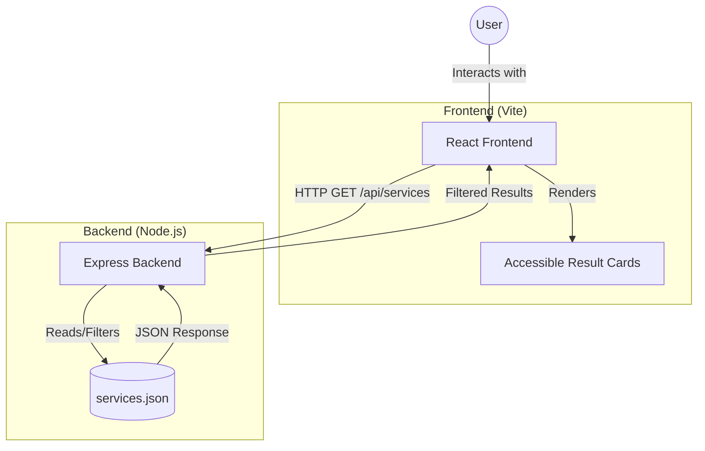

# <p align="center">🇮🇳 GovPortal: Accessible Public Services Portal</p>

<p align="center">
  
  
  
  
  
</p>

<p align="center">
  <strong>A high-fidelity, full-stack implementation of a government services portal, designed to prove that accessibility and modern aesthetics can coexist.</strong>
</p>

---

## 🌟 Project Vision

`GovPortal` is not just a search tool; it is a **blueprint for inclusive digital governance**. By reverse-engineering the National Portal of India, this project transforms critical accessibility audit findings into a seamless, high-performance user experience.

### ✨ Core Pillars
- **♿ Inclusive by Design**: Every pixel is audited for WCAG 2.1 compliance.
- **⚡ Blazing Fast**: Built with Vite and a lightweight Express API for near-instant response times.
- **🎨 Institutional Elegance**: A design language that balances official authority with modern usability.

---

## 🏗️ System Architecture

The project follows a strict **separation of concerns** to ensure scalability and maintainability.



---

## 🛠️ The Accessibility Remediation Matrix

This project serves as a direct technical response to a structural audit.

| ID | Finding | ❌ Legacy Problem | ✅ GovPortal Solution | Impact |
| :--- | :--- | :--- | :--- | :--- |
| **WEB-001** | **Alt Text** | "Loading..." placeholders | Descriptive `thumbnailAlt` for all assets | 🟢 High |
| **WEB-002** | **DOM Duplication** | Separate Mobile/Desktop HTML | Single responsive CSS Grid layout | 🟡 Med |
| **WEB-003** | **Ambiguous Links** | Repeated "View All" text | Dynamic `aria-label` for every link | 🟢 High |
| **WEB-004** | **Heading Logic** | Inconsistent H1/H2 levels | Strict semantic hierarchy (H2 $\rightarrow$ H3) | 🟡 Med |
| **WEB-005** | **Focus Traps** | Custom virtual keyboards | Native HTML5 inputs & keyboard focus | 🟢 High |

---

## 🚀 Getting Started

### 📦 Installation
```bash
# Clone the repository
git clone <your-repo-url>
cd gov-service-audit

# Install dependencies for all workspaces
npm install
```

### ⚡ Execution
This project requires two active processes:

| Component | Command | Port | Purpose |
| :--- | :--- | :--- | :--- |
| **Backend** | `npm run dev:server` | `4000` | Serves the filtered JSON data |
| **Frontend** | `npm run dev:client` | `5173` | Renders the accessible UI |

---

## 🧪 Quality Assurance

We use a dual-layer testing strategy to ensure zero regressions in accessibility.

### 1. API Validation
Verifies the data integrity and filtering logic.
```bash
npm run test:server
```

### 2. Accessibility Contract (AC)
Uses **Vitest** and **React Testing Library** to programmatically ensure that accessibility fixes (like `aria-labels` and `alt` text) are present in the DOM.
```bash
npm run test:client
```

---

## 🎨 Design System

- **Typography**: `Outfit` (Headings) & `Inter` (Body) for a balance of character and clarity.
- **Palette**: 
  - `Primary Blue (#003366)`: Authority and Trust.
  - `Action Blue (#0056b3)`: Interaction and Guidance.
  - `Focus Gold (#ffc107)`: High-visibility accessibility markers.
- **Motion**: Subtle `cubic-bezier` transitions and `text-reveal` animations for a premium feel.

---

<p align="center">
  <strong>Built with ❤️ for a more inclusive Digital India.</strong>
</p>
